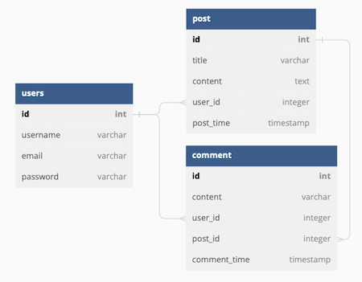

# My Blog


## Description

This project is a blog website which allows users to create an account and login. User can create, update and delete posts. They can also add comments under a post. [Passport Local strategy](https://www.passportjs.org/packages/passport-local/) is used for authenticating with user email and password. [Bcrypt](https://www.npmjs.com/package/bcrypt) is used to hash passwords. Dynamic HTML is generated by [Express-handlebars](https://www.npmjs.com/package/express-handlebars).

View the deployed website: https://my-blog-4001.herokuapp.com

## Table of Contents
- [Installation](#installation)
- [Usage](#usage)
- [License](#license)
- [Technologies Used](#technologies-used)
- [Question](#question)

## Installation

1. Run `git@github.com:RuxinQu/my-blog.git` on the terminal to git clone the repo.
2. Then run `npm install` to download all the packages.
3. Add a *.env* file in the root directory containing the code below:
```
DB_HOST='hostname'
DB_NAME='database_name'
DB_USER='database_username'
DB_PW='database_password'
```

## Usage
* Below is the entity relationship diagram:


* View the demo video of the website: [**HERE**](https://drive.google.com/file/d/1SW0fx8QfAWdwdcp7pRpZk3NpOZ8aMSVg/view)
1. Open the website then users can see all the existing posts at Home page.
2. After signup/login, users can see their previous posts at Dashboard page.
3. Click on the post title on dashboard page, user can *update* or *delete* their post.
4. Click on the post title on home page, user can see the comments below the post and add new comments.
5. Only **one** account can be registered per email. The password has to be more than **8** charactors.
6. When the user tries to change the url to modify someone else's post, no permission message will show up to protect data security.
7. Here are several test accounts: 
```
1. "email" : "xiaobai@test.com", "password": "helloxiaobai"
2. "email" : "dahuang@test.com", "password": "dahuangisadog"
```

## License

This project is under [MIT license](https://opensource.org/lsicenses/MIT).

## Technologies Used

- [Express](https://expressjs.com)
- [Express-session](https://www.npmjs.com/package/express-session)
- [Express-handlebars](https://www.npmjs.com/package/express-handlebars)
- [Passport-Local](https://www.passportjs.org/packages/passport-local/)
- [Bcrypt](https://www.npmjs.com/package/bcrypt)
- [Sequelize](https://sequelize.org/docs/v6/)
- [Mysql2](https://www.npmjs.com/package/mysql2)
- [Dotenv](https://www.npmjs.com/package/dotenv)
- [Heroku](https://www.heroku.com)
- [dbdiagram.io](https://dbdiagram.io/home)

## Question

 Contact me via: ruxinqu@gmail.com if you have questions.
